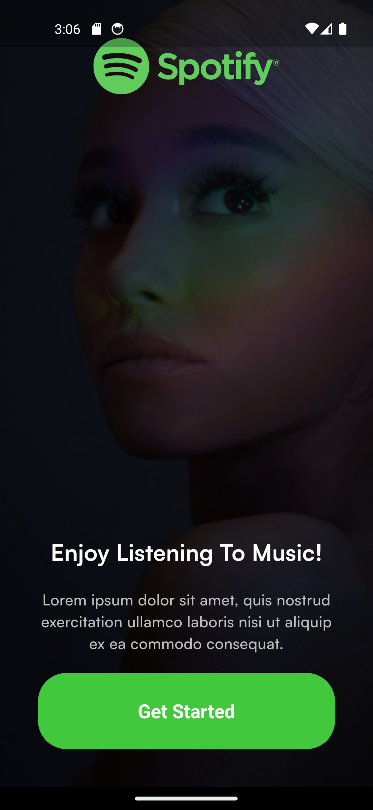
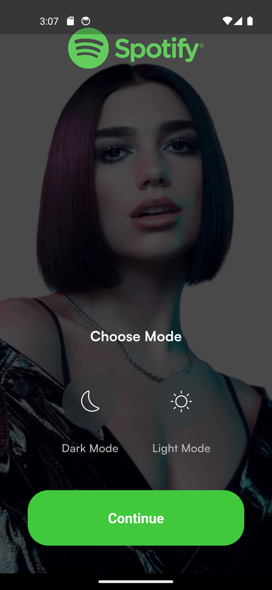
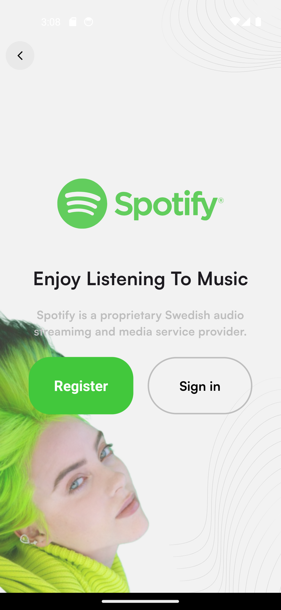
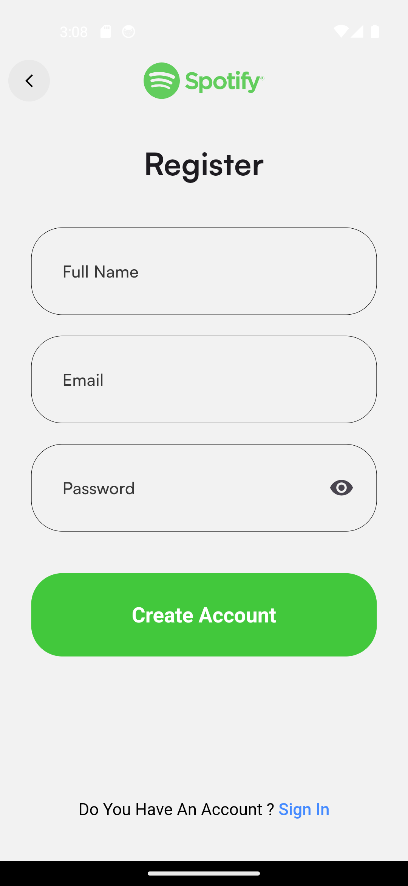
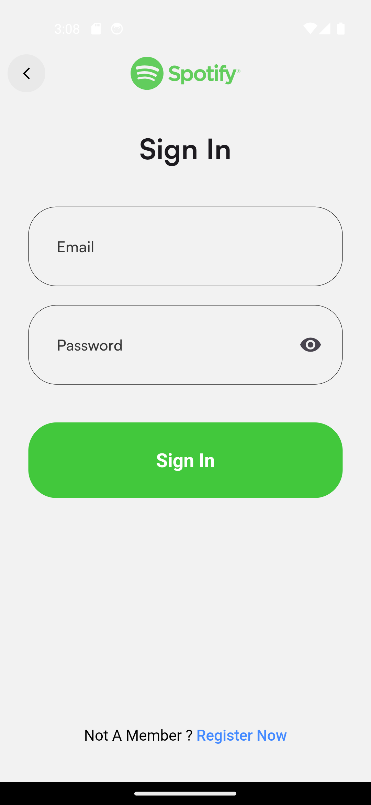
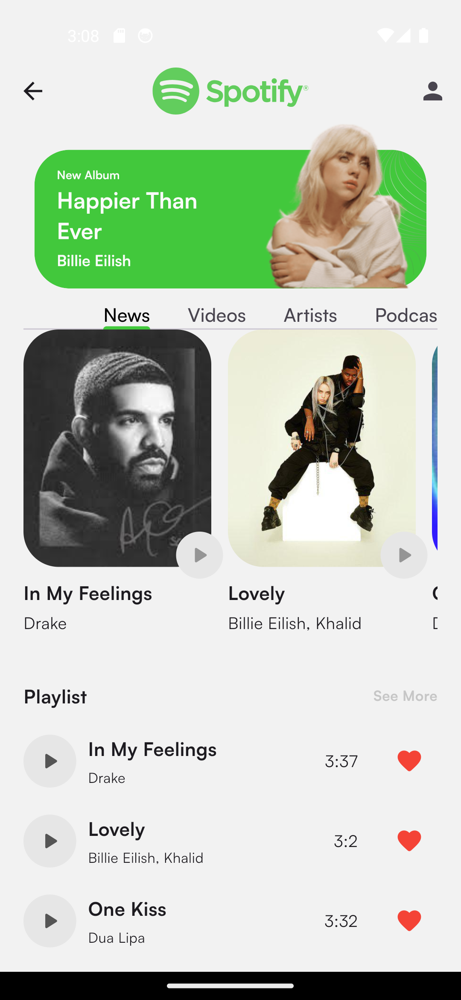
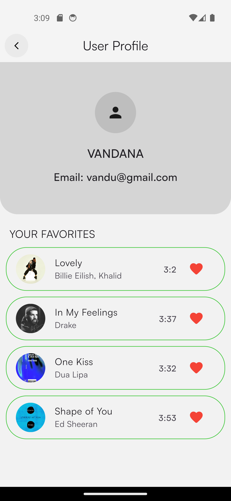
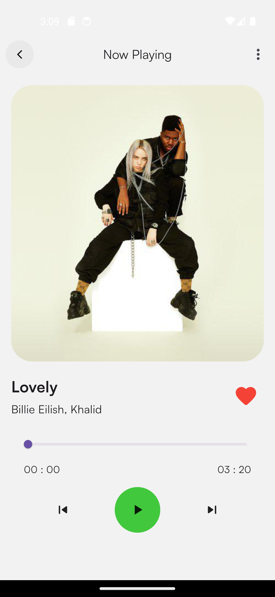

# spotify_clone

🎵 Spotify Clone

A feature-rich music streaming application built with Flutter that implements clean architecture principles and advanced state management.It's features are inspired by core features of Spotify App.

This project demonstrates full-stack mobile development expertise, focusese on scalable architecture, efficient state management, and smooth user experience.

  
  
  
  
  
  
  
  
  

🎯 Project Overview

Problem Statement:
Building a music streaming application presents several technical challenges:

- Managing complex state across multiple screens and features like song's favorite status.
- Implementing secure user authentication and data storage.
- Handling audio streaming with efficient memory management.
- Creating a responsive UI that works across different screen sizes.

Solution Approach:

This application addresses these challenges through:

🏗 Clean Architecture Implementation

- To create this app SOLID principles are used.
- Separation of concerns using data, domain, and presentation layers having independent business logic that's easily testable and maintainable, and used GetIt for clear dependency flow to make the codebase scalable.

📊 Efficient State Management

- Using BLoC pattern for predictable state flows
- Implementing cubits for small scale and simpler state management scenarios.
- Maintaining clear separation between UI and business logic.

🎵 Optimized Audio Handling

- Custom audio player implementation with precise controls like play and pause, and also drag feature.
- Efficient streaming from Firebase Storage.

✨ Key Features

- Authentication & User Management

- Animated splash screen with Spotify logo.
- Light and dart theme selection.
- Email/password authentication using Firebase Auth.
- Secure token management and persistence.
- Protected routes and authentication state management.
- Personalized user profiles.
- Input validation and error handling.

🎵 Music Player Engine

- Full-featured audio player with play/pause controls
- Progress bar with drag feature
- Real-time progress tracking
- Precise seeking functionality
- Beautiful song cover art display
- Display of song details like - Song Title and Artist Name

📚 User Library System

- Favorite songs list functionality
- Real-time synchronization with Firebase
- Easy navigation between songs

🎨 Theme Management

- Dynamic theme switching (Light/Dark mode)
- Persistent theme preferences
- Real-time UI updates using BLoC pattern
- Custom theme implementation

📱 UI/UX Features

- Clean and intuitive user interface
- Smooth animations and transitions
- Responsive design
- Tab-based navigation for different sections:

 - News
 - Videos
 - Artists
 - Podcasts

🛠 Technical Implementations

Architecture & Design Patterns

- Clean Architecture implementation
- Use of SOLID principles
- Repository pattern
- Factory pattern for dependency injection(Use of GetIt)
- BLoC pattern and Cubit for state management

Frontend Development

Flutter Widgets

- Custom widget creation
- Complex layouts with nested widgets
- Responsive design implementation

State Management

- BLoC/Cubit implementation
- Stream controllers
- State persistence
- Memory leak prevention

Backend Integration

Firebase Services

- Authentication implementation
- Cloud Storage for media files(mp3 Audio file and Song Cover Images)
- Real-time data synchronization
- Security rules implementation
- Firebase Firestore to store user info and his song favorite list

Code Quality & Best Practices

- Proper error handling
- Code documentation
- Clean code principles
- Performance optimization techniques

📈 Performance Metrics

- Initial load time: < 2 seconds
- Smooth scrolling: 60 fps

🏗 Project Structure
Copylib/
├── core/
│   ├── common/
│   ├── theme/
│   ├── usecase/
│   └── utils/
└── features/
    ├── auth/
    ├── home/
    └── song_player&fav/
        ├── data/
        ├── domain/
        └── presentation/

💡 Technical Challenges & Solutions:

Challenge 1: Audio Streaming Optimization
Problem: Efficient handling of audio streaming while maintaining app performance.
Solution:

Implemented custom buffering logic
Used lazy loading for audio streams
Optimized memory usage through proper resource disposal

Challenge 2: State Management Complexity
Problem: Managing complex state across multiple features and screens.
Solution:

Implemented BLoC pattern with clear state definitions
Created unified state management approach
Used stream controllers for real-time updates

⚙️ Installation

Clone the repository

bashCopygit clone https://github.com/yourusername/spotify-clone.git

Navigate to project directory

bashCopycd spotify-clone

Install dependencies

bashCopyflutter pub get

Run the app

bashCopyflutter run

Prerequisites:

- Flutter SDK
- Android Studio / VS Code
- Firebase account and project setup
- Android emulator or physical device

🔧 Configuration

- Create a Firebase project
- Add your google-services.json file to the Android app
- Update Firebase configuration in the project
- Enable Firebase Authentication and Storage services

🤝 Contributing
Contributions are welcome! Please feel free to submit a Pull Request.

📄 License
This project is licensed under the MIT License - see the LICENSE.md file for details

🙏 Acknowledgments

- Firebase for backend services
- Flutter team for the amazing framework
- Spotify for design inspiration

A few resources to get you started if this is your first Flutter project:

- [Lab: Write your first Flutter app](https://docs.flutter.dev/get-started/codelab)
- [Cookbook: Useful Flutter samples](https://docs.flutter.dev/cookbook)

For help getting started with Flutter development, view the
[online documentation](https://docs.flutter.dev/), which offers tutorials,
samples, guidance on mobile development, and a full API reference.
